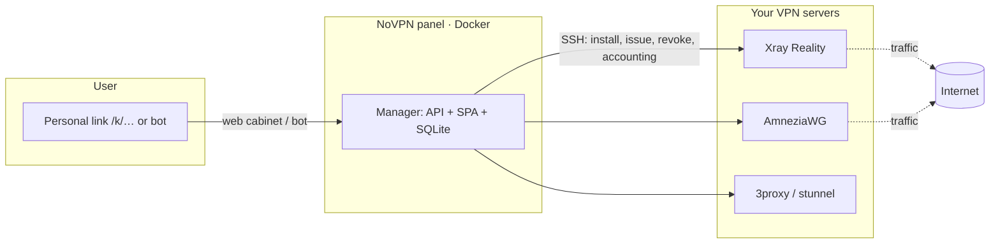

<div align="center">

# NoVPN

**Self‑hosted VPN control panel: AmneziaWG + Xray (VLESS/Reality) + proxies, one‑command install.**

Add your own servers — the panel installs the VPN software on them over SSH, issues configs
to users and accounts for traffic. Each user gets **one personal link** and connects from any
device on their own — Telegram not required.

[Features](#features) · [One‑command install](#one-command-install) · [How it differs](#how-it-differs-from-3x-ui-marzban-etc) · [Architecture](#architecture) · [Русский](README.md)

</div>

---

## Why

I wanted **AmneziaWG with a proper panel** and humane access issuance. Existing tools
(3X‑UI, Marzban, etc.) are built mostly around Xray/VLESS and **can't roll out AmneziaWG keys
properly**, and issuance usually means the admin fiddling with each client by hand.

NoVPN is built around two ideas:

1. **Self‑service.** You hand a user one personal link. They open it on any device, issue
   their own config (an Xray subscription or an AmneziaWG `.conf`) and connect. No mandatory
   Telegram, no per‑user manual work.
2. **One click and it's up.** A single command on a server installs the panel. Then you add a
   server right from the web UI and the panel **deploys Xray, AmneziaWG and optional
   HTTP/SOCKS5/HTTPS proxies over SSH** itself. No ENV to configure.

Everything else — censorship‑bypass routing, failover, quotas — exists to keep it **simple**
for both the admin and the user.

## Features

- **AmneziaWG and Xray (VLESS/Reality)** on one server, plus optional HTTP/SOCKS5/HTTPS proxies.
- **Self‑service via a personal link** `/k/<token>` — passwordless login, config in a couple
  of taps. For Xray, **one subscription link for all devices** (the app keeps configs updated).
- **Install VPN software over SSH from the web.** Add a server (host + SSH) → “Install” → the
  panel sets up Xray/AmneziaWG/proxies, generates keys, configures Reality.
- **Whitelist bypass + failover.** Full Xray config: Russian domains go direct, the rest via
  Reality; if Xray is blocked, traffic fails over across servers and proxies
  (Xray → HTTPS → HTTP → SOCKS → direct). The bypass domain list is editable in the admin UI.
- **Quotas and expiry.** Per‑user traffic/device/expiry limits. On quota exhaustion the peer is
  **removed from the server** (WireGuard has no auto‑cutoff); when restored it comes back with
  the **same key**, no re‑issue.
- **Telegram bot (optional).** Config issuance, “My devices” with deletion, `/id`.
- **Traffic accounting**, auto‑disable of inactive devices, broadcast, encrypted backups
  (`*.novpnbak`), at‑rest secret encryption (AES‑256‑GCM).
- **Secure by default.** Mandatory admin password change on first login, anti‑fixation
  sessions, secrets never returned by the API.

## One‑command install

On a clean Linux server (Ubuntu/Debian; may be the same box that will run the VPN):

```bash
curl -fsSL https://raw.githubusercontent.com/DanT2000/0VPN/main/install.sh | sudo bash
```

The script installs Docker (if missing), builds and starts the panel, **generates all
secrets**, and prints the address and starting password. No ENV needed — unpack and run.

<details>
<summary>Custom port / directory (if 3000 is taken or co‑locating with the VPN)</summary>

```bash
PORT=8088 DIR=/opt/novpn bash -c \
  "curl -fsSL https://raw.githubusercontent.com/DanT2000/0VPN/main/install.sh | sudo -E bash"
```
</details>

<details>
<summary>For those who want manual control (docker compose)</summary>

```bash
git clone https://github.com/DanT2000/0VPN.git novpn && cd novpn
docker compose -f deploy/docker-compose.yml up -d --build
```

The panel generates and stores secrets in the `novpn_data` volume on first start. To set them
yourself, copy `.env.example` to `.env` (everything in it is optional).
</details>

After start, open `http://SERVER‑ADDRESS:3000`, log in with password `admin` and **change it
immediately** (the panel requires it). Then: Servers → add → Install.

## First run

1. Log in with the admin password (`admin`) and change it.
2. Settings → **Site address** — the public panel address (all links derive from it).
3. Settings → **Service name** — your brand in the subscription/configs (optional).
4. **Servers → add**: host, SSH access, protocols → “Install / reinstall software”.
5. **Users → create** → send the person their personal link. Done.

## How it differs from 3X‑UI, Marzban, etc.

| | NoVPN | Typical Xray panel |
|---|---|---|
| AmneziaWG with proper key issuance | ✅ on par with Xray | ⚠️ usually none/hacky |
| User self‑service via link (no admin) | ✅ | ❌ admin issues keys |
| Mandatory Telegram | ❌ not required | often yes |
| Install VPN software on a server from web over SSH | ✅ | ❌ do it by hand |
| One config with RU‑domain bypass + failover | ✅ built‑in | ⚠️ manual |
| Panel install with no ENV, one command | ✅ | ⚠️ edit configs |
| AmneziaWG quotas with real peer removal/restore | ✅ | ⚠️ |

NoVPN doesn't try to be an everything‑box. It's about **simple issuance and operation** —
fewer manual steps for both admin and user.

## Architecture



- **Panel** (one Docker container): JSON API + SPA + SQLite on a persistent volume. Manages
  servers **over SSH** — no agent required on the servers themselves.
- **VPN servers** — plain Ubuntu/Debian with root SSH. The panel installs software and edits
  configs itself.

UI screenshots are in [`press/`](press/) (see the [capture guide](press/screenshots/README.md)).

## Update

```bash
# same command as install — does git pull + rebuild
curl -fsSL https://raw.githubusercontent.com/DanT2000/0VPN/main/install.sh | sudo bash
```

The `novpn_data` volume survives rebuilds; migrations apply automatically.

## Development

npm workspaces monorepo, Node.js ≥ 20.

```bash
npm install
npm run dev        # manager (API, :3000) + web (Vite, :5173)
npm run typecheck
npm test
npm run build
```

## License

See [LICENSE](LICENSE).

> Legal note: use only on your own servers and within the laws of your jurisdiction. This
> project is a tool for administering your own access, not a means to break the law.
