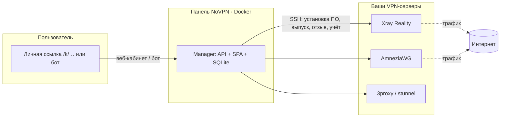

<div align="center">

# NoVPN

**Самостоятельная панель управления VPN: AmneziaWG + Xray (VLESS/Reality) + прокси, установка в одну команду.**

Заводите свои серверы — панель по SSH сама ставит на них VPN‑ПО, выпускает пользователям
конфиги и считает трафик. Пользователь получает **одну личную ссылку** и с любого
устройства сам подключается — Telegram не обязателен.

[Возможности](#возможности) · [Установка в одну команду](#установка-в-одну-команду) · [Чем отличается](#чем-отличается-от-3x-ui-marzban-и-прочих) · [Архитектура](#архитектура) · [English](README.en.md)

</div>

---

## Зачем это

Хотелось **AmneziaWG с нормальной панелью** и человеческой выдачей доступов. Существующие
решения (3X‑UI, Marzban и т. п.) заточены в основном под Xray/VLESS и **не умеют
по‑человечески выкатывать ключи на AmneziaWG**, а сама выдача обычно требует, чтобы админ
руками возился с каждым клиентом.

NoVPN построен вокруг двух идей:

1. **Самовыдача.** Вы даёте пользователю одну личную ссылку. Он открывает её с любого
   устройства, сам выпускает себе конфиг (Xray‑подписку или `.conf` AmneziaWG) и
   подключается. Никакого обязательного Telegram, никакой ручной возни на каждого.
2. **Один клик — всё поднялось.** Одна команда на сервере ставит панель. Дальше сервер
   добавляется прямо из веба, и панель **по SSH сама** разворачивает Xray, AmneziaWG и,
   при желании, HTTP/SOCKS5/HTTPS‑прокси. ENV настраивать не нужно.

Всё остальное — обход блокировок, аварийный фоллбэк, квоты — сделано ради того, чтобы
и админу, и пользователю было **просто**.

## Возможности

- **AmneziaWG и Xray (VLESS/Reality)** на одном сервере, плюс опциональные HTTP/SOCKS5/HTTPS‑прокси.
- **Самовыдача по личной ссылке** `/k/<токен>` — вход без пароля, конфиг за пару тапов.
  Для Xray — **одна ссылка‑подписка на все устройства** (приложение само обновляет конфиги).
- **Установка VPN‑ПО по SSH из веба.** Добавили сервер (host + SSH) → «Установить» → панель
  сама ставит Xray/AmneziaWG/прокси, генерирует ключи, настраивает Reality.
- **Обход «белых списков» + аварийный фоллбэк.** Полный Xray‑конфиг: российские домены —
  напрямую, остальное — через Reality; если Xray заблокируют, трафик сам переключается по
  цепочке серверов и прокси (Xray → HTTPS → HTTP → SOCKS → напрямую). Список доменов
  обхода правится прямо в админке.
- **Квоты и сроки.** Лимит трафика/устройств/срок действия на пользователя. При исчерпании
  квоты пир **снимается с сервера** (у WireGuard нет авто‑отключения), при восстановлении —
  возвращается **тем же ключом**, без перевыпуска.
- **Telegram‑бот (опционально).** Выдача конфигов, «Мои устройства» с удалением, `/id`.
- **Учёт трафика**, автоотключение неактивных, экстренная рассылка, резервные копии
  (зашифрованный `*.novpnbak`), шифрование секретов в БД (AES‑256‑GCM).
- **Безопасно по умолчанию.** Обязательная смена пароля админа при первом входе, сессии с
  анти‑фиксацией, секреты никогда не возвращаются наружу.

## Как выглядит

<p align="center">
  
  
</p>
<p align="center">
  
  
</p>

Больше — в [`press/screenshots/`](press/screenshots/) (десктоп, телефон, тёмная тема).

## Установка в одну команду

На чистом Linux‑сервере (Ubuntu/Debian; можно на том же, где будет VPN):

```bash
curl -fsSL https://raw.githubusercontent.com/DanT2000/0VPN/main/install.sh | sudo bash
```

Скрипт сам поставит Docker (если нет), соберёт и поднимет панель, **сгенерирует все
секреты** и напечатает адрес и стартовый пароль. Никаких ENV задавать не нужно —
«распаковал и работает».

<details>
<summary>Свой порт / каталог (если 3000 занят или ставите рядом с VPN)</summary>

```bash
PORT=8088 DIR=/opt/novpn bash -c \
  "curl -fsSL https://raw.githubusercontent.com/DanT2000/0VPN/main/install.sh | sudo -E bash"
```
</details>

<details>
<summary>Вариант для тех, кто хочет контролировать сам (docker compose)</summary>

```bash
git clone https://github.com/DanT2000/0VPN.git novpn && cd novpn
docker compose -f deploy/docker-compose.yml up -d --build
```

Секреты панель сгенерирует и сохранит в томе `novpn_data` при первом старте. Хотите
задать вручную — скопируйте `.env.example` в `.env` (всё в нём необязательно).
</details>

После старта откройте `http://АДРЕС‑СЕРВЕРА:3000`, войдите паролем `admin` и **сразу
смените его** (панель потребует). Дальше — «Серверы» → добавить сервер → «Установить».

## Первый запуск

1. Войдите паролем администратора (`admin`) и смените его.
2. Настройки → **Адрес сайта** — публичный адрес панели (от него строятся все ссылки).
3. Настройки → **Название сервиса** — ваш бренд в подписке/конфигах (необязательно).
4. **Серверы → добавить**: host, SSH‑доступ, протоколы → «Установить / переустановить ПО».
5. **Пользователи → создать** → отправьте человеку его личную ссылку. Готово.

## Чем отличается от 3X‑UI, Marzban и прочих

| | NoVPN | Типичная Xray‑панель |
|---|---|---|
| AmneziaWG с нормальной выдачей ключей | ✅ наравне с Xray | ⚠️ обычно нет/костыли |
| Самовыдача пользователем по ссылке (без админа) | ✅ | ❌ ключи выдаёт админ |
| Обязательный Telegram | ❌ не нужен | часто да |
| Установка VPN‑ПО на сервер из веба по SSH | ✅ | ❌ ставишь руками |
| Один конфиг с обходом РФ‑доменов + аварийный фоллбэк | ✅ встроено | ⚠️ вручную |
| Установка панели без ENV, в одну команду | ✅ | ⚠️ правишь конфиги |
| Квоты AmneziaWG с реальным снятием/возвратом пира | ✅ | ⚠️ |

NoVPN не пытается быть комбайном «на всё». Он про **простоту выдачи и эксплуатации**:
меньше ручных шагов и у админа, и у пользователя.

## Архитектура



- **Панель** (один Docker‑контейнер): JSON API + SPA + SQLite на постоянном томе.
  Управляет серверами **по SSH** — на самих серверах агент не обязателен.
- **VPN‑серверы** — обычные Ubuntu/Debian с root по SSH. Панель ставит на них ПО и
  правит конфиги сама.

Скриншоты интерфейса — в [`press/`](press/) (см. [гайд по съёмке](press/screenshots/README.md)).

## Обновление

```bash
# та же команда, что при установке — сделает git pull + пересборку
curl -fsSL https://raw.githubusercontent.com/DanT2000/0VPN/main/install.sh | sudo bash
```

База в томе `novpn_data` переживает пересборку; миграции применяются автоматически.

## Резервные копии

- **Backup:** Настройки → «Скачать резервную копию» → зашифрованный паролем `*.novpnbak`.
- **Restore:** Настройки → «Восстановить из копии» → файл + пароль. Панель заменит базу и
  перезапустится.

## Разработка

Монорепо npm workspaces, Node.js ≥ 20.

```bash
npm install
npm run dev        # manager (API, :3000) + web (Vite, :5173)
npm run typecheck  # типы
npm test           # тесты
npm run build      # прод-сборка
```

| Путь | Назначение |
|------|------------|
| `apps/web` | Веб‑интерфейс (SPA): кабинет пользователя и админка |
| `apps/manager` | Backend / control plane: API, отдача SPA, SQLite, SSH |
| `packages/shared` | Общие TypeScript‑типы и контракты |
| `deploy/` | Dockerfile, docker‑compose, серверные скрипты |

## Лицензия

См. [LICENSE](LICENSE).

> Легальная памятка: используйте только на своих серверах и в рамках законодательства
> вашей юрисдикции. Проект — инструмент администрирования собственного доступа, а не
> средство для обхода закона.
