# NoVPN для компьютера — инструкция

**NoVPN** — приложение для Windows, которое пропускает через VPN **только то, что вам нужно**, а всё остальное оставляет ходить напрямую. Никаких «весь интернет через заграницу»: российские сервисы работают как обычно и на полной скорости, а нужные сайты и программы получают доступ через ваш сервер.

Приложение принимает подписку **любого провайдера** — просто вставьте ссылку, которую вам выдали.

> **Коротко о главном.** По умолчанию весь трафик идёт **напрямую**. Через VPN уходит только то, что вы отметили: отдельные сайты, программы или готовые списки. Это и называется **умной маршрутизацией**.

---

## Содержание

1. [Как это работает](#1-как-это-работает)
2. [Установка](#2-установка)
3. [Шаг 1. Подключение подписки](#3-шаг-1-подключение-подписки)
4. [Шаг 2. Быстрая настройка](#4-шаг-2-быстрая-настройка)
5. [Главный экран](#5-главный-экран)
6. [Режим работы: Прокси или TUN](#6-режим-работы-прокси-или-tun)
7. [Что пускать через VPN](#7-что-пускать-через-vpn)
8. [Подключение и выбор сервера](#8-подключение-и-выбор-сервера)
9. [Расширение для браузера](#9-расширение-для-браузера)
10. [Настройки](#10-настройки)
11. [Расширенные настройки](#11-расширенные-настройки)
12. [Обновление](#12-обновление)
13. [Тема и размер интерфейса](#13-тема-и-размер-интерфейса)
14. [Значок в трее](#14-значок-в-трее)
15. [Частые вопросы](#15-частые-вопросы)

---

## 1. Как это работает

Представьте два пути для вашего трафика:

- **Напрямую** — как без VPN. Сюда идёт всё, что вы не отметили: банки, госуслуги, российские сайты, игры, обычный интернет. Быстро и без посредников.
- **Через VPN** — сюда идёт только выбранное: сайты, которым нужен доступ, и отдельные программы.

Вы сами решаете, что попадает во второй путь. Всё остальное приложение не трогает.

Через VPN трафик можно направлять двумя способами — **Прокси** (для браузеров) и **TUN** (для программ). Разница описана в разделе [«Режим работы»](#6-режим-работы-прокси-или-tun).

---

## 2. Установка

1. Скачайте установщик и запустите его.
2. Установка проходит **без прав администратора** и не задаёт лишних вопросов — приложение ставится только для вашего пользователя.
3. После установки NoVPN запускается сам и дальше открывается вместе с Windows (это можно отключить в настройках).

> **Обновления** ставятся так же тихо и без прав администратора — приложение обновляет себя само и перезапускается. Подробнее — в разделе [«Обновление»](#12-обновление).

---

## 3. Шаг 1. Подключение подписки

При первом запуске приложение попросит подписку. Вставьте ссылку, которую вам выдал провайдер, и нажмите **Продолжить**.

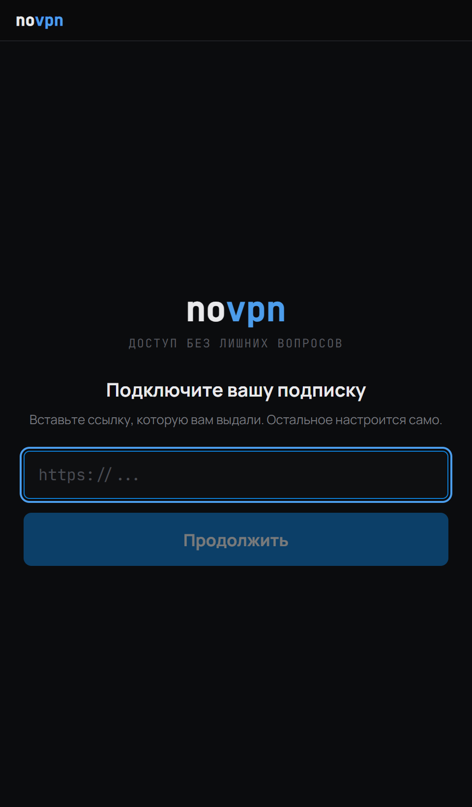

Приложение скачает список серверов и сохранит подписку, чтобы работать даже без интернета при следующем запуске.

---

## 4. Шаг 2. Быстрая настройка

Дальше — короткая настройка «под вас». Всё, что вы здесь выберете, потом можно поменять, а саму настройку — пройти заново в любой момент (см. [раздел 10](#10-настройки)).

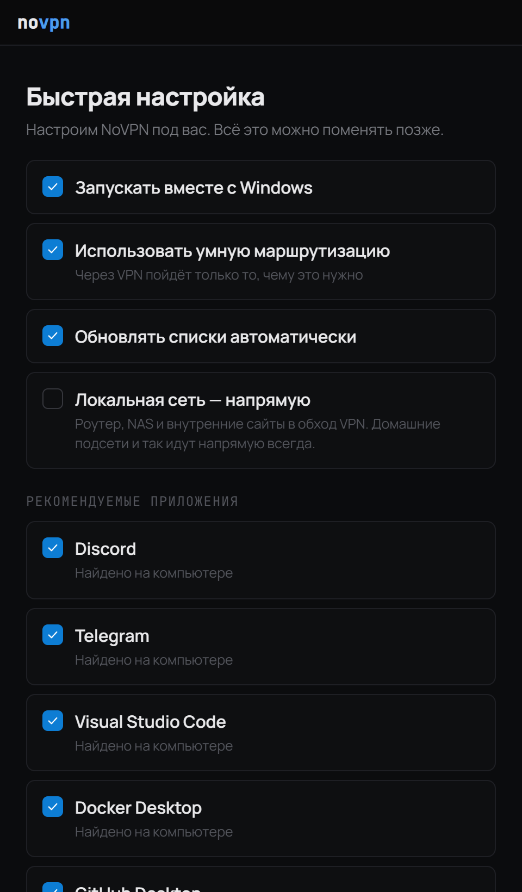

- **Запускать вместе с Windows** — приложение открывается при входе в систему.
- **Использовать умную маршрутизацию** — через VPN пойдёт только нужное (рекомендуется).
- **Обновлять списки автоматически** — готовые списки сайтов обновляются сами.
- **Локальная сеть — напрямую** — роутер, сетевое хранилище (NAS) и внутренние сайты в обход VPN.
- **Рекомендуемые приложения** — программы, найденные на вашем компьютере. Отмеченные сразу пойдут через VPN.
- **Использовать готовый список недоступных ресурсов** — включает основной набор сайтов, которым нужен VPN. Этот список обновляется автоматически.

> **После настройки VPN ещё выключен.** Нажмите большую кнопку **Запустить** на главном экране, чтобы включить защиту. Если оставить включённым «Подключаться автоматически», при следующих запусках VPN будет включаться сам.

---

## 5. Главный экран

Это центр приложения. Вверху — развилка **«Ваш трафик»**: слева то, что идёт напрямую, справа — то, что через VPN.

  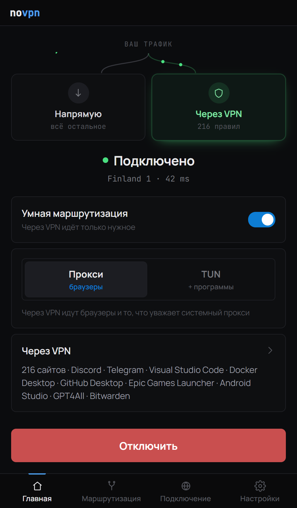
  &nbsp;&nbsp;
  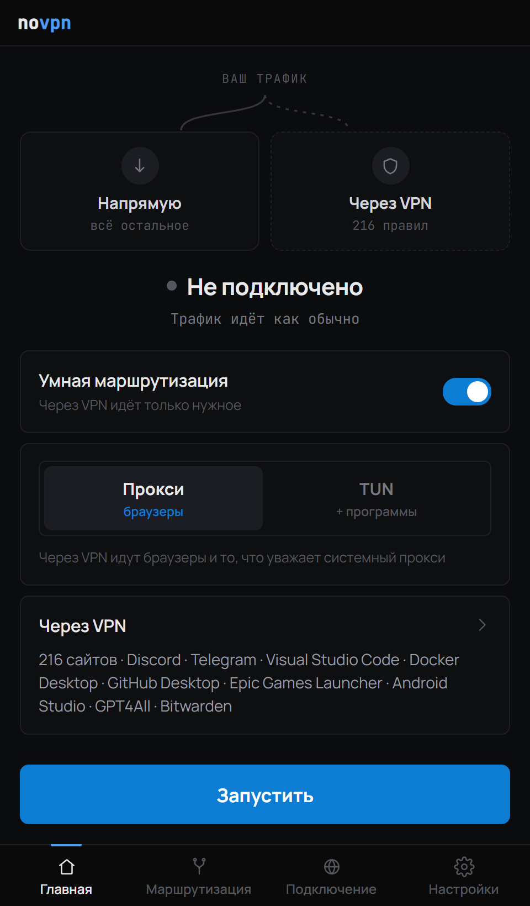

- **Запустить / Отключить** — большая кнопка внизу включает и выключает VPN.
- **Подключено / Не подключено** — текущее состояние, под ним — выбранный сервер и задержка (пинг).
- **Умная маршрутизация** — переключатель. Включена: через VPN идёт только нужное. Выключена: **весь** трафик идёт через VPN.
- **Через VPN** — краткий список того, что сейчас направлено в туннель. Нажмите на него, чтобы перейти к настройке правил.

### Если что-то пошло не так

Иногда вместо «Подключено» появляется цветная плашка — вот что она означает:

| Плашка | Что делать |
|--------|------------|
| **Не удалось подключиться · Сервер не отвечает** | Нажмите **Повторить**. Если не помогает — смените сервер во вкладке «Подключение». |
| **Нет интернета** | Проверьте связь. Приложение подключится, как только интернет вернётся. |
| **Подписка недействительна** | Откройте «Подключение» → **Обновить**, а если не помогло — **Изменить** и вставьте актуальную ссылку. |
| **Переподключение…** | Связь оборвалась, приложение восстанавливает её само. Ничего делать не нужно. |

---

## 6. Режим работы: Прокси или TUN

Прямо на главном экране — переключатель режима. Он решает, **как именно** выбранный трафик попадает в VPN.

  
  &nbsp;&nbsp;
  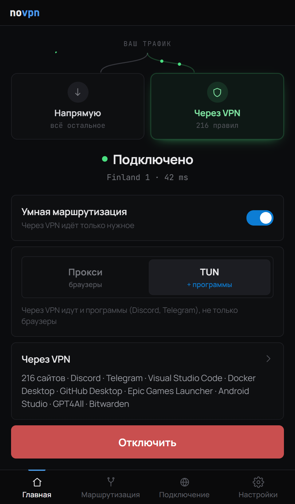

| Режим | Что идёт через VPN | Когда выбирать |
|-------|--------------------|----------------|
| **Прокси** | Браузеры и программы, которые умеют работать через системный прокси | Подходит большинству. Прав администратора не требует |
| **TUN** | **Всё**, включая программы, которые прокси игнорируют — Discord, Telegram, игры, настольные приложения | Когда через VPN нужны не только сайты, но и приложения |

> **Про права администратора.** Режим **TUN** один раз попросит права администратора. Если включено «Запускать вместе с Windows», дальше он поднимается при каждом входе в систему сам, **без повторных запросов**. Режиму **Прокси** права не нужны вовсе.

---

## 7. Что пускать через VPN

Раздел **«Маршрутизация»** (вкладка внизу) — здесь вы решаете, что идёт через VPN, а что напрямую.

Наверху — выбор режима отображения:

- **Простой** — знакомые названия и один из двух маршрутов. Этого хватает почти всегда.
- **Расширенный** — то же самое плюс подробности: имя процесса, путь к файлу и откуда взялось правило (автоматически, из списка или вручную). Полезно, когда несколько программ с одинаковым названием и нужно выбрать конкретную.

Ниже — три вкладки: **Приложения**, **Сайты** и **Списки**.

### Как сменить маршрут

Это главное действие в приложении:

1. **Нажмите на строку** приложения или сайта — откроется карточка.
2. В карточке выберите маршрут: **Через VPN** или **Напрямую**.
3. Чтобы удалить правило целиком, нажмите **Убрать**.

Переключатель (тумблер) справа от приложения — это не выбор маршрута, а **включение и выключение** самого правила. Выключенное правило = программа ходит как обычно, напрямую.

### Приложения

Программы с вашего компьютера. Через поиск и кнопку **«＋ Добавить»** можно добавить любую программу вручную. Бейдж напротив показывает текущий маршрут — **Через VPN** или **Напрямую**.

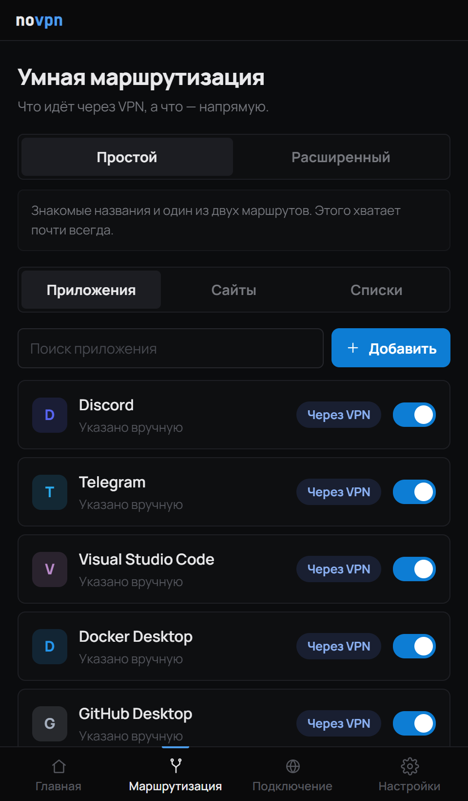

### Сайты

Отдельные домены. Добавляйте сайты, которым нужен доступ, — они пойдут через VPN. Можно и наоборот: принудительно отправить сайт **Напрямую** — например, чтобы вернуть напрямую то, что попало в VPN из готового списка.

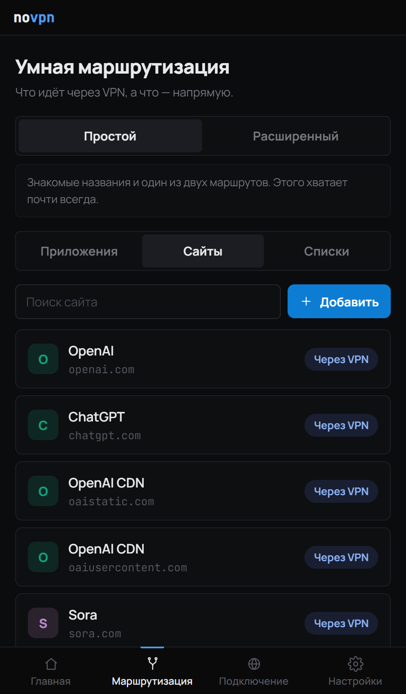

### Списки

Готовые наборы правил, которые приходят с сервера и обновляются сами. Список целиком либо включён, либо выключен.

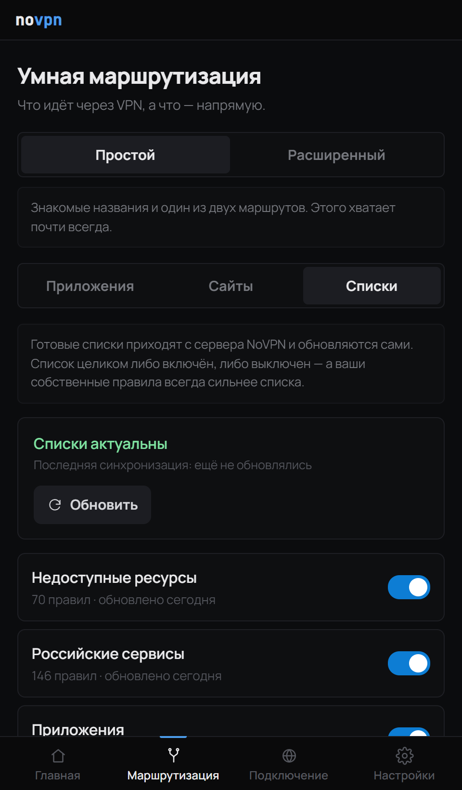

- **Недоступные ресурсы** — сайты, которым нужен VPN.
- **Российские сервисы** — ходят напрямую, иначе не пускают.
- **Приложения** — известные программы и их процессы.

> **Ваши правила всегда сильнее списков.** Если вы вручную отправили сайт напрямую или через VPN, это решение перебивает любой готовый список.

---

## 8. Подключение и выбор сервера

Вкладка **«Подключение»** — состояние подписки и выбор сервера.

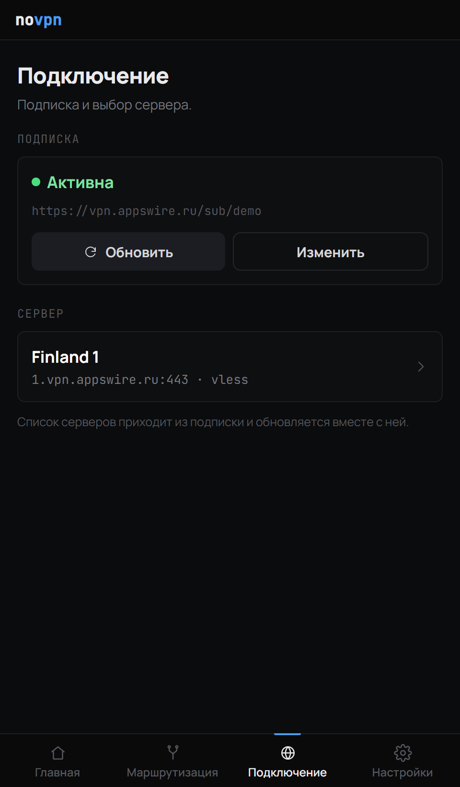

- **Подписка** — показывает, активна ли она. **Обновить** — подтянуть свежий список серверов, **Изменить** — вставить другую ссылку.
- **Сервер** — выбор из серверов, которые пришли в подписке. Нажмите на карточку, чтобы выбрать другой.

Список серверов приходит из подписки и обновляется вместе с ней.

---

## 9. Расширение для браузера

Чтобы переключать сайты прямо во время просмотра, установите расширение для вашего браузера. Кнопки установки — в **Настройках**, раздел **«Расширение для браузера»**.

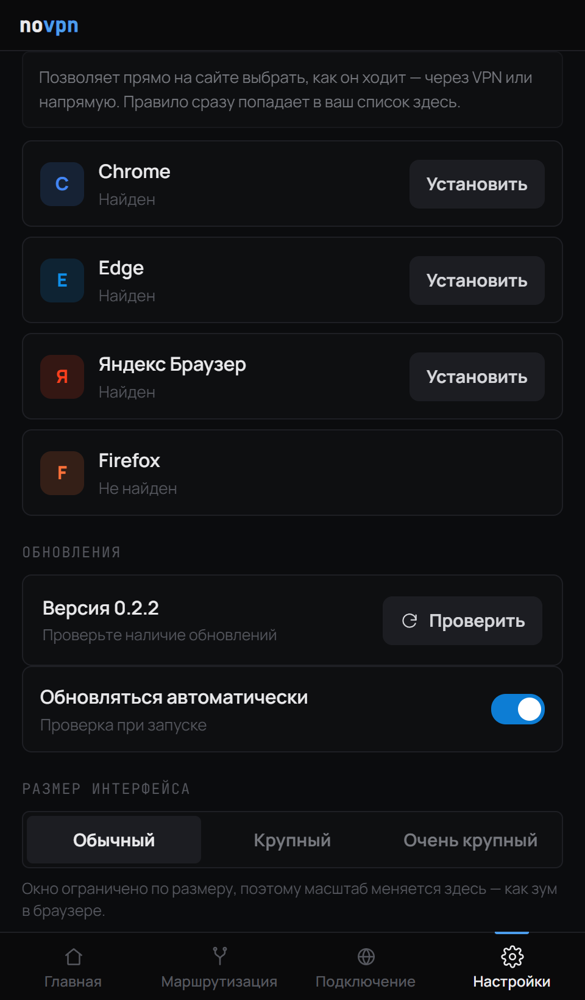

Расширение позволяет прямо на открытом сайте выбрать, как он ходит — **через VPN** или **напрямую**. Правило сразу попадает в ваш список на вкладке «Маршрутизация». Поддерживаются Chrome, Edge, Яндекс Браузер и другие.

---

## 10. Настройки

Вкладка **«Настройки»** — поведение приложения и внешний вид.

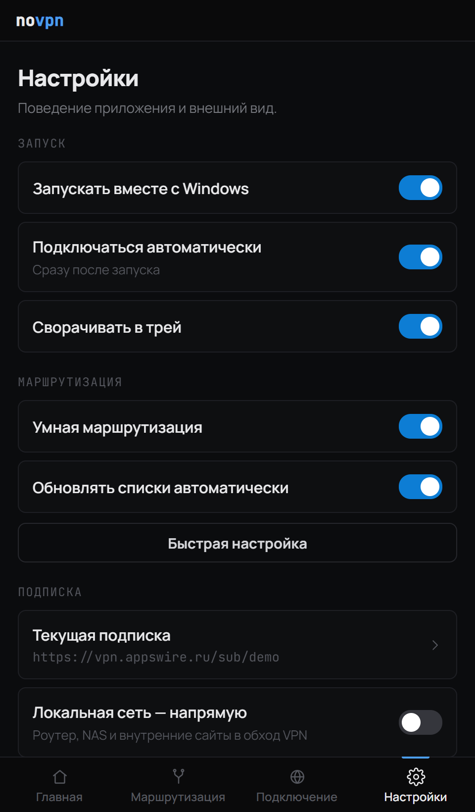

- **Запуск** — запускать вместе с Windows, подключаться автоматически при старте, сворачивать в трей.
- **Маршрутизация** — умная маршрутизация, автообновление списков и кнопка **«Быстрая настройка»**.
- **Подписка** — текущая ссылка; **Локальная сеть — напрямую** — роутер, сетевое хранилище (NAS) и внутренние сайты в обход VPN.
- **Расширение для браузера** — установка расширения (см. [раздел 9](#9-расширение-для-браузера)).
- **Обновления**, **Размер интерфейса**, **Тема** — ниже по списку.

### Быстрая настройка

Кнопка **«Быстрая настройка»** открывает тот же экран галочек, что и при первом запуске, — можно заново пройтись по автозапуску, умной маршрутизации и рекомендуемым приложениям. Это **безопасно**: подписку и ваши правила (приложения, сайты) она **не трогает**. А сменить саму подписку можно во вкладке «Подключение» → **Изменить**.

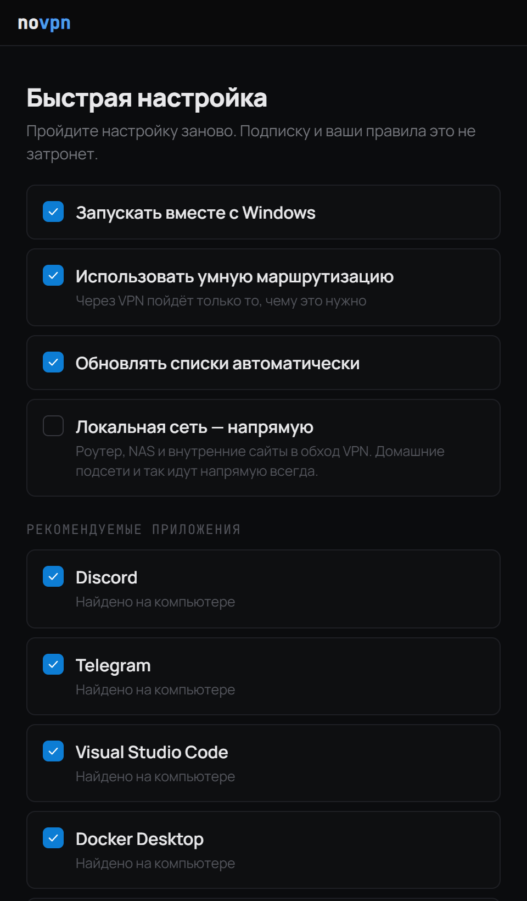

---

## 11. Расширенные настройки

В самом низу настроек — раздел **«Дополнительно» → «Расширенные настройки»**. Для тех, кто знает, зачем сюда зашёл.

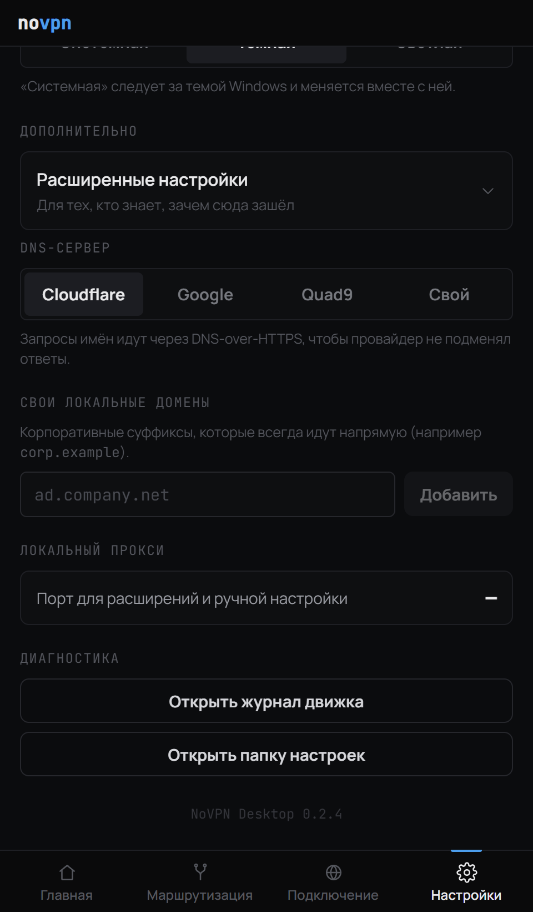

- **DNS-сервер** — Cloudflare, Google, Quad9 или **Свой** (укажите адрес домашнего/любого DNS или ссылку DoH; несколько — через запятую). DNS-запросы (запросы адресов сайтов) идут по DNS-over-HTTPS, чтобы провайдер не подменял ответы.

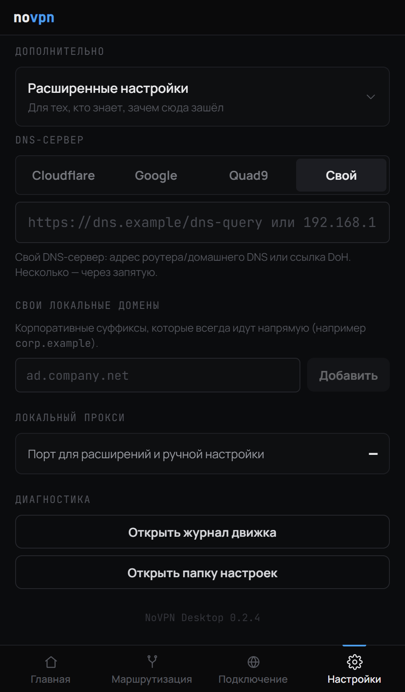

- **Свои локальные домены** — корпоративные суффиксы, которые всегда идут напрямую (например `corp.example`).
- **Локальный прокси** — порт для расширений и ручной настройки.
- **Диагностика** — открыть журнал работы (лог) или папку с настройками.

---

## 12. Обновление

NoVPN обновляется **в одно нажатие и без лишних кликов**. В настройках, раздел **«Обновления»**, видна текущая версия и кнопка **«Проверить»**.

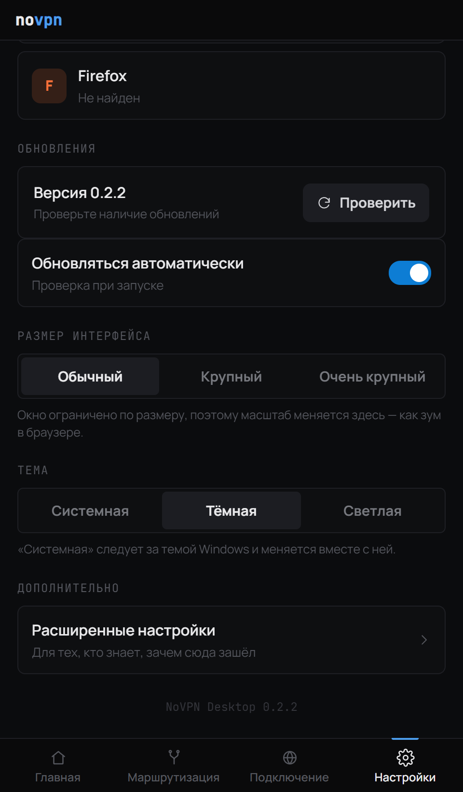

Когда выходит новая версия, приложение скачает её, проверит подпись, **само установится и перезапустится** — без окон установщика и без прав администратора. Флажок **«Обновляться автоматически»** включает проверку при каждом запуске.

---

## 13. Тема и размер интерфейса

Приложение поддерживает **светлую** и **тёмную** тему, а также режим **«Системная»** — он следует за темой Windows и меняется вместе с ней. Выбрать тему и размер можно в настройках (см. картинку в разделе выше).

  
  &nbsp;&nbsp;
  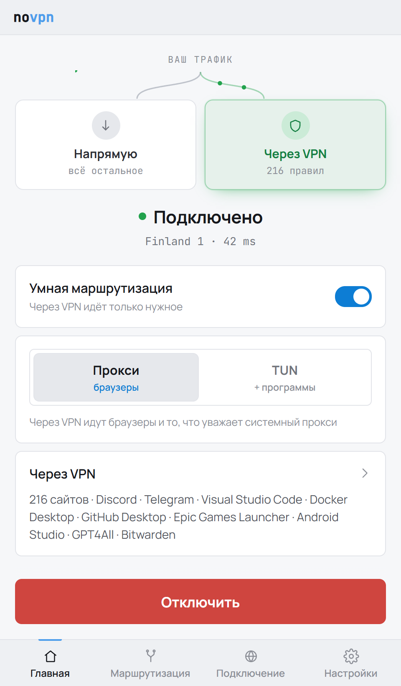

Рядом с темой — **размер интерфейса** (Обычный / Крупный / Очень крупный): окно ограничено по размеру, поэтому масштаб меняется здесь, как зум в браузере.

---

## 14. Значок в трее

Если включено «Сворачивать в трей», закрытие окна не выключает VPN — приложение прячется в область уведомлений. Значок показывает состояние: цветной — подключено, серый — нет.

Правый клик по значку открывает меню: **Подключить / Отключить** (то же, что большая кнопка в окне), **Открыть NoVPN** и **Выход**.

---

## 15. Частые вопросы

**Нужен ли VPN для всего интернета?**

Нет. В этом и смысл: через VPN идёт только то, что вы отметили. Всё остальное работает напрямую, на полной скорости.

**Почему сайт всё равно открывается напрямую?**

Проверьте, что он добавлен на вкладке «Маршрутизация» с маршрутом «Через VPN», а VPN включён. Для программ (не браузеров) нужен режим **TUN**.

**Discord / Telegram / игра не идут через VPN.**

Эти программы не используют системный прокси. Включите на главном экране режим **TUN** — он проводит через VPN и приложения тоже.

**TUN каждый раз просит права администратора.**

Только в первый раз — при условии, что включено «Запускать вместе с Windows». Тогда приложение стартует с нужными правами при каждом входе в систему автоматически, без повторных запросов.

**Пишет «Не удалось подключиться».**

Нажмите **Повторить**. Если сервер не отвечает — откройте «Подключение» и выберите другой сервер.

**Пишет «Подписка недействительна».**

Откройте «Подключение» → **Обновить**. Если не помогло — **Изменить** и вставьте актуальную ссылку.

**Пропал интернет после сбоя приложения.**

При следующем запуске NoVPN сам вернёт системный прокси в исходное состояние. Если приложение удалено во время работы — программа удаления тоже возвращает настройки сети.

**Можно ли использовать подписку другого провайдера?**

Да. Приложение принимает ссылку любого провайдера — вставьте её на вкладке «Подключение» → **Изменить**.

---

NoVPN для компьютера · доступ без лишних вопросов

