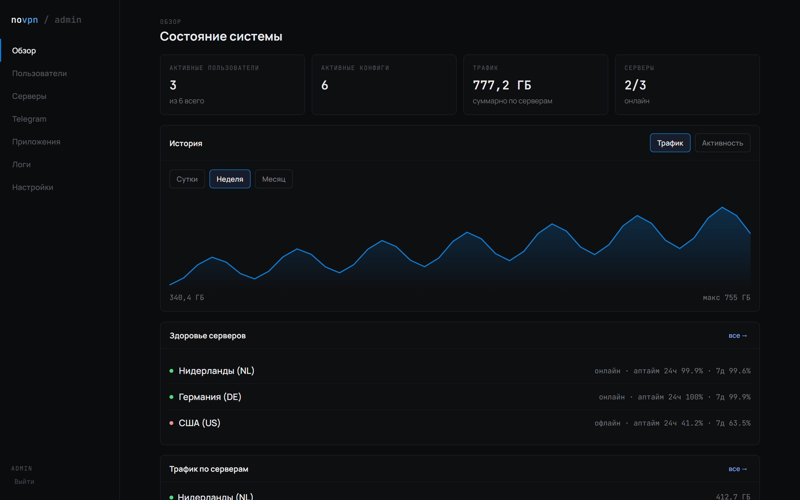
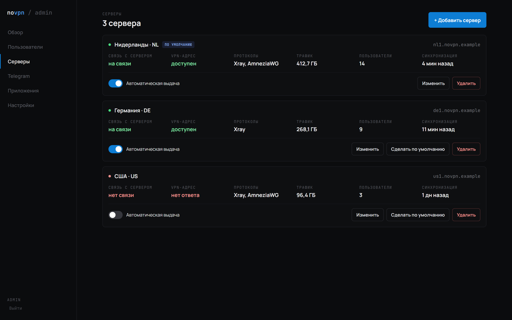
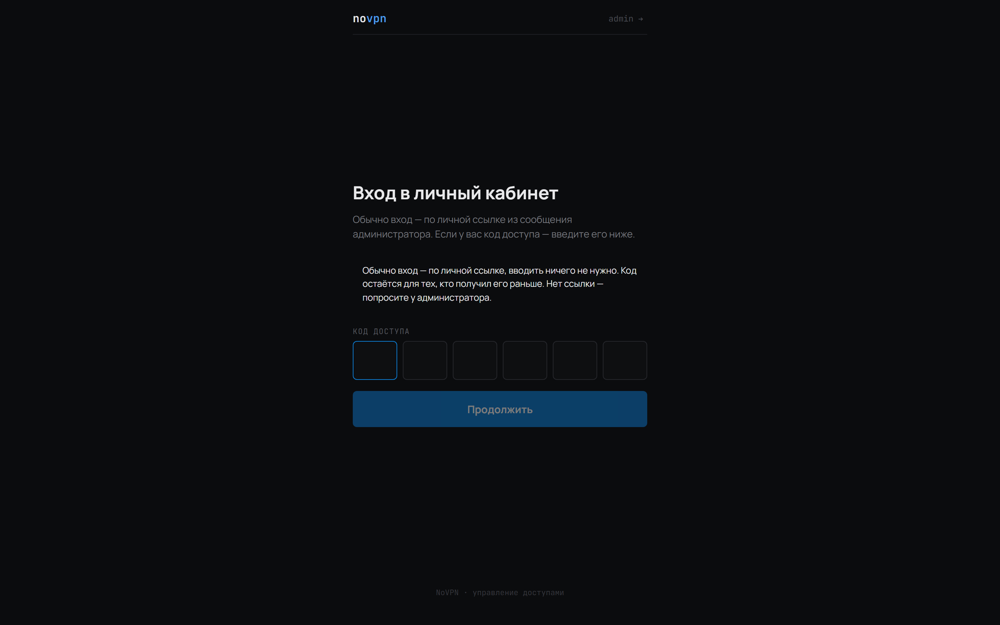
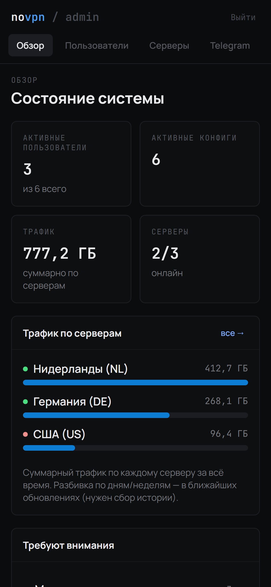
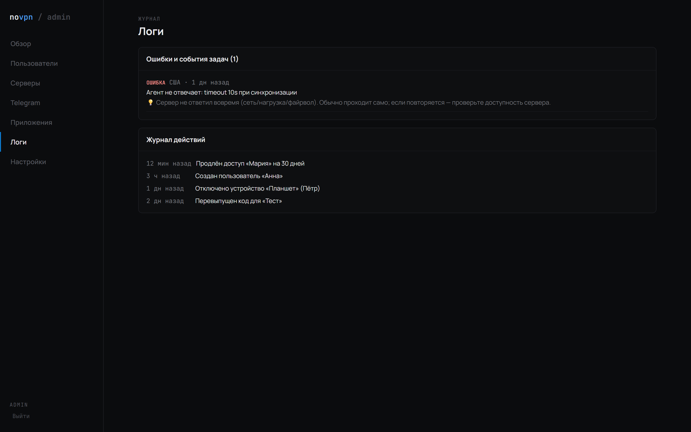

# NoVPN — a self-hosted panel where the user issues their own key (AmneziaWG + Xray)

> Article draft (EN). Screenshots live in `press/screenshots/`.

I don't like handing out keys by hand. If you run a couple of servers "for friends and family,"
you know the ritual: SSH in, generate a config, send the file, explain where to import it — and
repeat every time someone's phone changes. I got tired of it and built a panel where a person
gets **one link** and issues access to themselves, from any device. Without me.

Below, no fluff: why it exists, how it differs from off-the-shelf panels, how you use it and what's
inside. Open source: **https://github.com/DanT2000/NoVPN**



## Why I built it

Honestly — first of all for **AmneziaWG**. Xray/VLESS is handled fine by existing panels (3X‑UI,
Marzban, etc.), but I couldn't find humane AmneziaWG management with proper key issuance: it's
either missing or bolted on. And I need Amnezia as the primary protocol — it survives better on
hostile networks.

Then three more reasons shaped the project:

- **Custom Xray without clicking around.** I wanted to set even non‑standard configs and control
  them from one place, without switching between separate pieces of functionality.
- **Real traffic accounting and quotas** — not "on paper" (WireGuard has no "cut off by traffic,"
  so I had to build it — see below).
- **Simple access issuance.** The main thing. A person opens the site and issues to themselves.
  I do nothing.

It's a personal project: I use it myself and fix things as they surface. It's fairly stable now,
but I'm not pretending it's "enterprise for a million users" — it's a tool that does one thing well.

## What it's similar to, and how it differs

Closest relatives are 3X‑UI / Marzban. The differences that mattered to me:

| | NoVPN | Typical Xray panel |
|---|---|---|
| AmneziaWG with proper key issuance | yes, on par with Xray | usually none |
| User self‑service via a link | yes | no, admin issues |
| Mandatory Telegram | not required | often yes |
| Install VPN software on a server from the web over SSH | yes | do it by hand |
| One config: RU‑domain bypass + failover | built‑in | manual |
| Panel install with no ENV, one command | yes | edit configs |

I didn't try to build an everything‑box. The opposite — a narrow tool about simple operation.

## How you use it

**One command** on a clean server (may be the same box that runs the VPN):

```bash
curl -fsSL https://raw.githubusercontent.com/DanT2000/NoVPN/main/install.sh | sudo bash
```

It installs Docker, builds the image, starts the panel and **generates all secrets** — no `.env`,
no "generate a key with openssl." Unpack and run.

**Add a server from the web.** Enter host + SSH, tick the protocols — over SSH the panel installs
Xray (Reality), AmneziaWG and optional proxies, generates keys, configures everything. No agent on
the servers, just SSH.



**The user gets one link.** They open it on a phone or laptop — land in a passwordless cabinet (the
token is long, brute force is pointless) and get a config in a couple of taps: for Xray, one
subscription link for all devices; for AmneziaWG, a `.conf` or `vpn://`.



The cabinet and admin are responsive — same thing on a phone:



## What's inside (what it gives you)

**Bypass + failover.** The Xray subscription is a full routing config: Russian domains (editable in
the admin UI) go direct, the rest via Reality; if Xray is blocked, traffic fails over across servers
and proxies (Xray → HTTPS → HTTP → SOCKS → direct). Sniffing was the tricky part — without
`routeOnly`, domain rules don't fire in TUN mode and the whitelist didn't work until I sorted it.

**Quotas that actually cut access.** WireGuard has no "cut off by traffic," so on quota exhaustion
the panel **removes the peer from the server**, and on restoration brings it back with the **same
key**, no re‑issue. Keys stay encrypted in the DB (AES‑256‑GCM) the whole time.

**Monitoring: charts and uptime.** The overview shows traffic/activity history with a day/week/month
toggle (you can see load peaks), and per‑server uptime for 24h and 7d.

**Human‑readable logs.** Background‑job errors show a level and a short "what it is and what to do,"
next to an action journal. If a Telegram ID is set (get it from the bot with `/id`), the bot sends
error alerts and a daily digest. Management stays only in the web panel: Telegram gets notifications,
not commands — simpler and safer.



**Backups.** "Download backup" gives a password‑encrypted file carrying both the DB and the
encryption key — restoring on a new host brings everything back, including working configs and SSH
access to servers.

## Wrap‑up

If, like me, you wanted **AmneziaWG with a proper panel** and users **issuing access to themselves**
— grab it, one command to install, everything else via the web:

**https://github.com/DanT2000/NoVPN**

It's a live personal project; I polish it as I go. Issues/PRs welcome.
